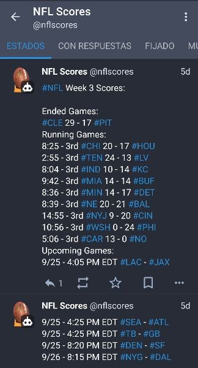

# XFL Bot, README.md under construction. Originally from https://mastodon.online/@nflscores:


# Bot Scoreboard NFL para Mastodon

Bot para Mastodon de Scoreboard de los partidos de la nfl. Funcionando actualmente en https://mastodon.online/@nflscores

## Tabla de contenidos

*   [Acerca del proyecto](#acerca-del-proyecto)
*   [Comenzando](#comenzando)
    *   [Requisitos](#dependencias)
    *   [Instalación](#instalación)
    *   [Uso](#uso)
*   [Tecnologías usadas](#tecnologías-usadas)
*   [Contribuir](#contribuir)
*   [Licencia](#licencia)

## Acerca del proyecto

Este proyecto implementa un bot para Mastodon con la información de los partidos de la semana de la NFL.

Actualmente este bot está funcionando en la cuenta de Mastodon https://mastodon.online/@nflscores



La API usada para la obtención de los datos es la de ESPN: http://site.api.espn.com/apis/site/v2/sports/football/nfl/scoreboard

Las motivaciones han sido, dar información deportiva en Mastodon que escasea bastante por un lado, y por otro, aprender algo de Python así como a desarrollar bots para Mastodon. Todo esto en un momento en qué la unica posibilidad para hacer algo de este tipo para mí era el uso de mi smartphone.

Puedes usar este proyecto para aprender como crear tu propio bot de Mastodon, para mejorarlo o crear uno similar para otros deportes.

## Requisitos

* Python 3.8+ (Debería funcionar también con 3.6+)
* Librerias adicionales: (extracto de pip freeze, pero debería funcionar también con versiones similares)
    * blurhash==1.1.4
    * certifi==2022.9.24
    * charset-normalizer==2.1.1
    * configparser==5.3.0
    * decorator==5.1.1
    * idna==3.4
    * Mastodon.py==1.5.1
    * python-dateutil==2.8.2
    * python-magic==0.4.27
    * pytz==2022.2.1
    * requests==2.28.1
    * six==1.16.0
    * urllib3==1.26.12

## Instalación

### Creacion de nuevo virtualenv

Es recomendable usar virtualenv para crear un nuevo entorno virtual y evitar conflictos con otras aplicaciones. [Aquí](
https://noroute2host.com/python-virtualenv.html) tienes una guía de como hacerlo.

### Clonación del repositorio

Usa git clone para clonar este repositorio en tu equipo.

```bash
git clone https://gitlab.com/noroute2host/nflscores-mastodon-bot
```

### Instalación de dependencias

Puedes instalar las [dependencias](#requisitos) con pip una a una o haciendo uso del fichero requeriments.txt del repositorio.

### Fichero de configuración

Para el correcto funcionamiento del bot se debe modificar el fichero de configuración. Hay un fichero de ejemplo en el repositorio.

El fichero de configuración deberá ser llamado `config.conf` y tiene este formato:

```ini
[API]
API_URL_SCB = http://site.api.espn.com/apis/site/v2/sports/football/nfl/scoreboard

[MASTODON]
ACCESS_TOKEN = TOKENSUPERSECRETO
API_BASE_URL = https://mastodon.online/
TOOTEAR = True
MAX_TAM_TOOT = 400
```

En la sección API solo está la URL de la API utilizada para la obtención de los datos.

Mientras la sección Mastodon se debe configurar acorde a los datos de la cuenta bot que se quiera usar indicando:

* El token para la publicación de los toots.
* La instancia donde se aloja.
* Un número de caracteres mejor al máximo número de caracteres por toot de la instancia.

## Uso

### Ejecucion simple

Se ejecuta simplemente llamando al mani.py con pyhon

```bash
python main.py
```

### Programación con Crond

Para automatizar las ejecuciones se puede usar cron en el cron de UNIX/linux o cualquier otra opción de programación de tareas. A continuación, hay un ejemplo de crontab de usuario con mayor número de posteos del bot en las horas de partido. (Ejemplo con horario de verano de España)

```
*/20 17-23 * * 0        /home/usuarioejemplo/python/virtualenvs/nflscores-bot/bin/python /home/usuarioejemplo/python/virtualenvs/nflscores-bot/app/main.py > /home/usuarioejemplo/python/virtualenvs/nflscores-bot/log/nflscores-bot-cron.log 2>&1
*/20 0-6 * * 1-2,5      /home/usuarioejemplo/python/virtualenvs/nflscores-bot/bin/python /home/usuarioejemplo/python/virtualenvs/nflscores-bot/app/main.py > /home/usuarioejemplo/python/virtualenvs/nflscores-bot/log/nflscores-bot-cron.log 2>&1
30 15,21,3,9 * * *      /home/usuarioejemplo/python/virtualenvs/nflscores-bot/bin/python /home/usuarioejemplo/python/virtualenvs/nflscores-bot/app/main.py > /home/usuarioejemplo/python/virtualenvs/nflscores-bot/log/nflscores-bot-cron.log 2>&1
```

## Tecnologías usadas

El desarrollo a sido completamente realizado en un teléfono movil. Usando para ello:

* [Python](https://www.python.org/) como lenguaje de programación.
* [Pydroid 3](https://play.google.com/store/apps/details?id=ru.iiec.pydroid3) como editor de código.
* [API de ESPN](http://site.api.espn.com/apis/site/v2/sports/football/nfl/scoreboard)
* [Python Tutorial](https://play.google.com/store/apps/details?id=com.codeliber.python) para refrescar y aprender cositas de Python.

## Contribuir

Colaborando con el código 💻

- 🍴 Haz un fork del repo [aquí](https://gitlab.com/noroute2host/nflscores-mastodon-bot/-/forks/new)
- 🔨 Dale caña
- 😊 Añadete como contribuidor
- 🔧 Haz una petición de pull [aquí](https://gitlab.com/noroute2host/nflscores-mastodon-bot/-/merge_requests)

Las peticiones de pull son bienvenidas. Para cambios mayores, por favor, abre un issue primero para discutir el cambio.

O simplemente creando un issue 😊

- 😯 Creando un issue [aquí](https://gitlab.com/noroute2host/nflscores-mastodon-bot/-/issues)

## Donation
[..]

## Licencia

Este peoyecto está licenciado bajo la licencia **GNU General Public License v3.0**. Para más detalles se puede consultar el fichero LICENSE.txt de este repositorio.

